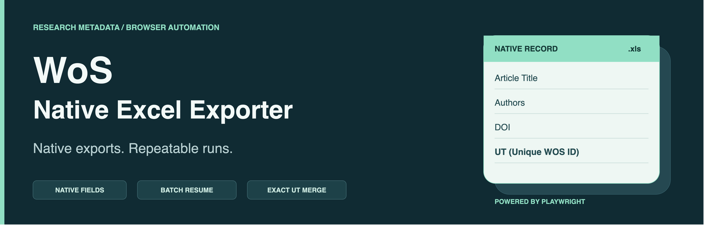
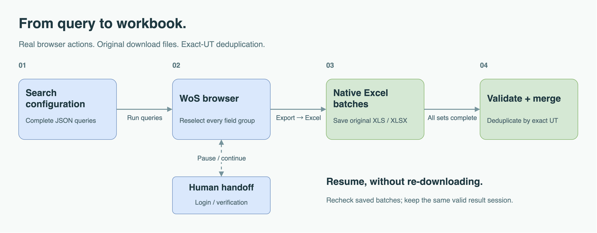

<p align="center">
  <strong>English</strong> · <a href="README.zh-CN.md">简体中文</a>
</p>

<p align="center">
  
</p>

<p align="center">
  <strong>Web of Science Core Collection → native Excel → one deduplicated workbook.</strong><br>
  A standalone Playwright tool for literature metadata collection.
</p>

<p align="center">
  <a href="#quick-start">Quick start</a> ·
  <a href="#how-it-works">Workflow</a> ·
  <a href="#configure-a-search">Configuration</a> ·
  <a href="#outputs">Outputs</a> ·
  <a href="#verified-workflow">Verification</a>
</p>

---

## Overview

**Automate the export you would perform yourself.** This tool opens a visible Chromium browser, runs your search queries, selects the complete set of export fields, and clicks **Export → Excel** in WoS. It saves the original downloads, checks each batch, and merges completed search sets by their unique WoS identifiers (UTs).

No GPT session, userscript, internal API replay, or TXT-to-Excel conversion is involved.

| Native by design | Built for repeat runs | Traceable results |
| :--- | :--- | :--- |
| Original XLS/XLSX downloads | Configurable search sets and batch sizes | Original batches retained |
| Native column names and order | Resume saved batches in a valid session | UT-to-search-set membership |
| References and funding fields included | Human handoff for login or verification | Record-level source and conflict details |

## Quick start

**Requirements:** Node.js **22+**, the Playwright-managed Chromium browser, a desktop session, and access to **Web of Science Core Collection** through your subscription or institution.

The website must use its **English interface**. The documentation is bilingual; terminal messages are currently in Chinese. The repository is public and can be cloned directly.

### 1. Install

```sh
git clone https://github.com/JYao-Chen/wos-native-excel-exporter.git
cd wos-native-excel-exporter
npm ci
npx playwright install chromium
```

### 2. Run the included search strategy

```sh
npm start -- --config examples/wearsteel.json --out output/wearsteel-001
```

The browser opens visibly. The included configuration runs **nine search sets** from the wear-resistant steel literature strategy: P1–P8 and a related-alloy comparison set. It is a complete collection task, not a short demonstration query.

### 3. Find your results

Open `output/wearsteel-001/WoS-native-merged.xlsx` after the task completes. Original downloads remain in `output/wearsteel-001/raw/`.

Use a **new output directory** for a new collection. To continue an interrupted run, use the same configuration and output directory with `--resume`.

## How it works

<p align="center">
  
</p>

1. **Search.** Submit complete query expressions to WoS Core Collection and read the actual result count.
2. **Export.** Set each record range and reselect all four custom field groups **for every batch**; WoS can reset these selections.
3. **Check.** Confirm that each download is a real Excel file with the expected row count, required fields, and unique UTs.
4. **Merge.** Once all sets are complete, deduplicate by exact UT and save search-set membership separately.

Zero-result searches are recorded as such. A timeout, login screen, or server error is **not** treated as zero results.

## Configure a search

Copy [the included configuration](examples/wearsteel.json) and replace its `queries` for a new topic. For example:

```json
{
  "url": "https://webofscience.clarivate.cn/wos/woscc/advanced-search",
  "batchSize": 1000,
  "delayMs": 3000,
  "queries": [
    {
      "id": "P1",
      "name": "Wear-resistant steel",
      "query": "TS=(\"wear-resistant steel*\") AND DT=(Article OR Review OR \"Proceedings Paper\")"
    }
  ]
}
```

| Setting | Meaning |
| :--- | :--- |
| `url` | Core Collection advanced search on `webofscience.clarivate.cn` or `www.webofscience.com` |
| `batchSize` | Records per batch; integer **1–1000**, also checked against the website's displayed limit |
| `delayMs` | Pause after a saved batch; at least **1000 ms**, default **3000 ms** |
| `queries[].id` | Unique set identifier: letters, numbers, hyphens, or underscores; starts with a letter or number |
| `queries[].name` | Optional readable label |
| `queries[].query` | Complete WoS query expression; session-dependent references such as `#1 AND #2` are rejected |

There is no additional post-search filtering. Express your document types, years, and other scope constraints in the query itself. Downloads run **sequentially**, not in parallel.

<details>
<summary><strong>Command-line options</strong></summary>

| Option | Purpose |
| :--- | :--- |
| `--config <file>` | Required. Search configuration JSON |
| `--out <directory>` | Required. Output directory for this run |
| `--resume` | Recheck saved files and continue the same task |
| `--profile <directory>` | Use a separate persistent browser profile |
| `--non-interactive` | Exit on failure without waiting for terminal input; this is **not** headless mode |
| `--help` | Show command usage |

```sh
npm start -- --help
```

</details>

## Resume & human handoff

```sh
npm start -- --config examples/wearsteel.json --out output/wearsteel-001 --resume
```

- **Completed sets:** saved files are rechecked and skipped, not downloaded again.
- **Incomplete sets:** resume uses the original result URL only while that session remains valid and the result count is unchanged.
- **Expired or changed results:** start a new collection in a new directory rather than mixing old and new batches.
- **Login or verification:** in interactive terminal mode, finish the requested action in the browser, press Enter in the terminal, then rerun with `--resume`. Verification is handled by the user.

The default browser profile is stored outside the repository at `~/.local/share/wos-native-exporter/profile`. It does not copy cookies from your everyday Chrome profile. Keep this directory private and do not run two instances against the same profile.

<details>
<summary><strong>What happens on a website error?</strong></summary>

- An explicit 502/503/504 error on the advanced-search page triggers at most two delayed page reloads.
- If the custom field menu fails to load, the original results page is reloaded once **before any download is initiated**.
- Other failures pause the task and preserve saved batches. A screenshot is attempted for diagnosis when the page remains available.
- Login and verification are not handled through blind retries. With `--non-interactive`, the program saves progress and exits instead of waiting for input.

</details>

## Outputs

| File or directory | Contents |
| :--- | :--- |
| `WoS-native-merged.xlsx` | One workbook with native fields, deduplicated by exact UT |
| `raw/<set>/` | Untouched native Excel batches and their manifest |
| `set-membership.csv` | Each UT linked to all search sets in which it appeared |
| `searches.json` | The complete configuration used for the run |
| `status.json` | Per-set progress and the final summary |
| `WoS-native-merged.sources.json` | Source files and rows, duplicate-field differences, and line-break details |
| `last-page.png` | Diagnostic screenshot, when a failure can be captured |

If every query returns zero results, the task records the outcome without creating an empty merged workbook.

### Data preservation rules

**Original files stay original.** The merged workbook preserves native column names, column order, values, numeric types, and hyperlinks. It is a derived workbook—not a single WoS download—and does not promise identical visual styling.

**Deduplication is by exact UT.** When the same UT appears in multiple sets, the first complete record is retained. Values from different records are not spliced together; different UTs are not collapsed merely because their DOIs match.

**No TXT wrapping is introduced.** Native line breaks remain intact, including meaningful separators in references or addresses. The standard collection command does not flatten prose or silently truncate long fields.

## Verified workflow

A real collection run on **September 10, 2026**, used Playwright **1.63.0** and its Chromium **153.0.8010.12** browser.

| Search sets | Native batches | Exported rows | Unique UTs | Native fields |
| :---: | :---: | :---: | :---: | :---: |
| **9** | **8** | **2,267** | **2,103** | **72** |

The dataset includes material, thematic, platform-method, and related-alloy sets; the total is not a count of core wear-resistant steel papers alone. This run found **164 cross-set duplicates**, **zero conflicting fields** for duplicate UTs, and **zero CR/LF cells**. These are recorded results, not fixed values for future searches.

A separate live test interrupted an 11-record set after records **1–6**. Resume downloaded only **7–11**, leaving the first batch unchanged.

See the [English test record](docs/LIVE_TEST.en.md) or [中文实测记录](docs/LIVE_TEST.md).

### Local tests

```sh
npm test
```

Six targeted tests cover configuration, counts, incomplete fields, invalid downloads, missing or overlapping batches, browser field selection and reloads, native download preservation, merging, and completed-run reuse. They use local browser fixtures and **do not query WoS**.

## Project map

```text
src/          Browser workflow, Excel validation, and merging
examples/     Reusable search configurations
tests/        Local browser and data-processing tests
vendor/       SheetJS and its Apache-2.0 license
docs/         Recorded live tests and editable visual assets
```

## Access, privacy & licensing

The repository does not contain paper metadata, downloaded batches, cookies, login state, or runtime logs. Store browser profiles outside the repository; the documented `output/` directory is ignored by Git. Review diagnostic screenshots before sharing them.

Use the tool within your database access rights and the service's terms. This is an independent project, not an official Clarivate product.

This project is open source under the [MIT License](LICENSE). SheetJS CE **0.20.3** retains its [Apache-2.0 license](vendor/LICENSE); Playwright is installed through npm under its own license.

The `private: true` setting in `package.json` prevents accidental npm publishing; it does not restrict GitHub access or the MIT license.

---

<p align="center">
  <strong>Keep the native record. Make the workflow repeatable.</strong><br>
  <a href="README.zh-CN.md">阅读中文版 →</a>
</p>
