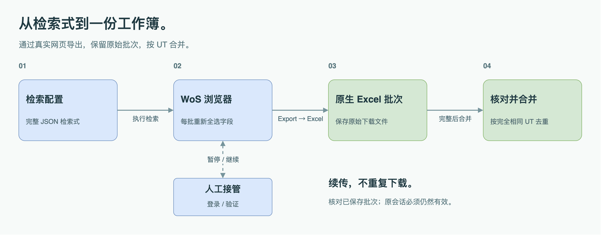

<p align="center">
  <a href="README.md">English</a> · <strong>简体中文</strong>
</p>

<p align="center">
  
</p>

<p align="center">
  <strong>Web of Science 核心合集 → 原生 Excel → 一份去重合并表。</strong><br>
  基于 Playwright 的独立论文元数据采集工具。
</p>

<p align="center">
  <a href="#快速开始">快速开始</a> ·
  <a href="#工作流程">工作流程</a> ·
  <a href="#配置检索任务">检索配置</a> ·
  <a href="#输出文件">输出文件</a> ·
  <a href="#实测验证">实测验证</a>
</p>

---

## 项目介绍

**把手动导出的步骤，变成可重复执行的程序。** 本工具打开可见的 Chromium 浏览器，执行检索式，勾选完整导出字段，并点击 WoS 网页上的 **Export → Excel**。每批原始下载文件均被保留、核对；全部集合完成后，按 WoS 唯一标识 UT 合并去重。

整个过程不需要 GPT 会话、油猴脚本、内部接口请求重放，也不经过 TXT 转换。

| 保留原生数据 | 支持重复运行 | 结果可追溯 |
| :--- | :--- | :--- |
| 保存原始 XLS/XLSX 文件 | 自定义检索集合与批次大小 | 保留全部原始批次 |
| 保留原生列名和列顺序 | 在有效会话中断点续传 | UT 对应全部命中集合 |
| 包含参考文献与基金字段 | 登录、验证时人工接管 | 记录来源与重复字段差异 |

## 快速开始

**运行条件：** Node.js **22+**、Playwright 配套 Chromium、桌面环境，以及通过个人订阅或机构获得的 **Web of Science Core Collection** 访问权限。

WoS 页面需使用**英文界面**。项目文档提供中英文版本，终端提示目前为中文。仓库已公开，可直接克隆。

### 1. 安装

```sh
git clone https://github.com/JYao-Chen/wos-native-excel-exporter.git
cd wos-native-excel-exporter
npm ci
npx playwright install chromium
```

### 2. 执行随附检索策略

```sh
npm start -- --config examples/wearsteel.json --out output/wearsteel-001
```

程序会打开可见浏览器。随附配置包含耐磨钢文献策略中的 **9 个检索集合**：P1–P8 及相关合金对照集。这是一项完整采集任务，而不是少量记录的演示检索。

### 3. 查看结果

任务完成后，打开 `output/wearsteel-001/WoS-native-merged.xlsx`。网页原始下载文件保存在 `output/wearsteel-001/raw/`。

新采集任务使用**新的输出目录**。继续被中断的任务时，保留原配置和输出目录，并添加 `--resume`。

## 工作流程

<p align="center">
  
</p>

1. **检索：** 向 WoS 核心合集提交完整检索式，读取实际命中数。
2. **导出：** 设置记录范围，**每一批都重新勾选**四组自定义字段，避免网站重置选项造成字段缺失。
3. **核对：** 检查文件是否为真实 Excel，记录数是否正确，完整记录字段及 UT 是否齐全，批次是否重叠。
4. **合并：** 全部集合完成后，按完全相同的 UT 去重，另存集合归属关系。

真正的零结果会被记录；超时、登录页面和服务器错误**不会被当作零结果**。

## 配置检索任务

复制[随附配置](examples/wearsteel.json)，替换 `queries` 即可用于新主题。例如：

```json
{
  "url": "https://webofscience.clarivate.cn/wos/woscc/advanced-search",
  "batchSize": 1000,
  "delayMs": 3000,
  "queries": [
    {
      "id": "P1",
      "name": "Wear-resistant steel",
      "query": "TS=(\"wear-resistant steel*\") AND DT=(Article OR Review OR \"Proceedings Paper\")"
    }
  ]
}
```

| 配置项 | 含义 |
| :--- | :--- |
| `url` | `webofscience.clarivate.cn` 或 `www.webofscience.com` 的核心合集高级检索地址 |
| `batchSize` | 每批记录数，取 **1–1000** 的整数，同时核对网页当前显示的上限 |
| `delayMs` | 每批保存后的等待时间，至少 **1000 毫秒**，默认 **3000 毫秒** |
| `queries[].id` | 唯一集合编号；由字母、数字、横线、下划线组成，以字母或数字开头 |
| `queries[].name` | 可选的集合名称 |
| `queries[].query` | 完整 WoS 检索式；不接受依赖其他会话的 `#1 AND #2` 等集合编号 |

程序不额外筛选检索结果。文献类型、年份和其他范围约束应写入检索式。下载按批次**串行执行**，不并发抓取。

<details>
<summary><strong>命令行参数</strong></summary>

| 参数 | 用途 |
| :--- | :--- |
| `--config <file>` | 必填，检索配置 JSON |
| `--out <directory>` | 必填，本次任务的输出目录 |
| `--resume` | 核对已有文件并继续同一任务 |
| `--profile <directory>` | 指定独立的持久化浏览器目录 |
| `--non-interactive` | 失败时退出，不等待终端输入；**不是**无头浏览器模式 |
| `--help` | 查看命令说明 |

```sh
npm start -- --help
```

</details>

## 续传与人工接管

```sh
npm start -- --config examples/wearsteel.json --out output/wearsteel-001 --resume
```

- **已完成集合：** 重新核对已保存文件后跳过，不重复下载。
- **未完成集合：** 仅在原结果会话有效、命中数未变化时，通过原结果 URL 续传。
- **会话失效或结果改变：** 换新输出目录重新采集，避免混入不同排序或不同时间的批次。
- **登录或验证：** 在交互式终端运行时，先在浏览器人工完成，再回到终端按 Enter，随后添加 `--resume` 重新运行。

浏览器默认使用仓库之外的 `~/.local/share/wos-native-exporter/profile`，不复制日常 Chrome 的 Cookie。该目录含登录状态，请勿分享，也不要同时启动两个程序使用同一目录。

<details>
<summary><strong>遇到网站异常时会怎样？</strong></summary>

- 高级检索页明确出现 502/503/504 时，最多等待后重载两次。
- 自定义字段菜单未加载时，在**尚未启动下载**的前提下重载原结果页，重试一次。
- 其他失败会暂停任务，保留已保存批次；页面仍可访问时尝试保存诊断截图。
- 登录和验证不通过盲目重试处理。使用 `--non-interactive` 时，程序保存进度后直接退出，不等待输入。

</details>

## 输出文件

| 文件或目录 | 内容 |
| :--- | :--- |
| `WoS-native-merged.xlsx` | 按完全相同的 UT 去重、保留原生字段的合并表 |
| `raw/<set>/` | 未改动的网页原生 Excel 批次及清单 |
| `set-membership.csv` | 每个 UT 对应的全部命中集合 |
| `searches.json` | 本次执行的完整检索配置 |
| `status.json` | 各集合进度与最终汇总 |
| `WoS-native-merged.sources.json` | 来源文件和行号、重复字段差异、换行信息 |
| `last-page.png` | 发生失败且页面可截图时生成的诊断图片 |

如果全部检索均为零结果，程序记录结果，但不创建空的合并工作簿。

### 数据保留规则

**原始文件保持原样。** 合并表保留原生列名、列顺序、值、数值类型及超链接。它是整理后的工作簿，不是一次网页导出的文件，也不承诺与原始文件的视觉样式完全一致。

**按完全相同的 UT 去重。** 同一个 UT 命中多个集合时，保留首次出现的完整记录，不拼接不同版本的字段，也不会仅因 DOI 相同就合并不同 UT。

**不引入 TXT 续行。** 原生文件已有的换行会被保留，包括参考文献、地址中的有效分隔。标准采集命令不会统一压平正文，也不会静默截断超长字段。

## 实测验证

**2026 年 9 月 10 日**的真实采集使用 Playwright **1.63.0** 及其配套 Chromium **153.0.8010.12**。

| 检索集合 | 原生批次 | 原始记录 | 去重后 UT | 原生字段 |
| :---: | :---: | :---: | :---: | :---: |
| **9** | **8** | **2,267** | **2,103** | **72** |

数据包含材料、专题、平台方法和相关合金对照文献，总数不等同于核心耐磨钢论文数量。本次消除 **164 条跨集合重复**，同 UT 记录的字段冲突为 **0**，包含 CR/LF 的单元格为 **0**。这些是本次实测值，不是后续检索的固定结果。

另一次真实测试将 11 条记录分成两批：下载 **1–6** 后主动中断，续传时仅下载 **7–11**，第一批文件未被覆盖。

查看[中文实测记录](docs/LIVE_TEST.md)或 [English test record](docs/LIVE_TEST.en.md)。

### 本地测试

```sh
npm test
```

6 项定向测试覆盖配置、数量、字段缺失、错误下载、缺批与重叠、浏览器字段勾选和页面重载、原始下载保留、合并以及已完成任务复用。测试使用本地模拟页面，**不向 WoS 发起检索**。

## 项目结构

```text
src/          浏览器操作、Excel 核对与合并
examples/     可复用检索配置
tests/        本地浏览器与数据处理测试
vendor/       SheetJS 及 Apache-2.0 许可证
docs/         真实实测记录与可编辑图形资源
```

## 访问权限、隐私与许可证

仓库不包含论文元数据、下载批次、Cookie、登录状态或运行日志。浏览器目录应保留在仓库之外；上述命令使用的 `output/` 目录已被 Git 忽略。诊断截图分享前请确认内容。

使用时遵守数据库访问权限及服务条款。本项目为独立工具，并非 Clarivate 官方产品。

项目采用 [MIT 开源许可证](LICENSE)。SheetJS CE **0.20.3** 保留其 [Apache-2.0 许可证](vendor/LICENSE)；Playwright 通过 npm 安装，遵循其自身许可证。

`package.json` 中保留的 `private: true` 仅用于防止误发布到 npm，不影响 GitHub 公开访问或 MIT 开源许可。

---

<p align="center">
  <strong>保留原生记录，让采集过程可复用。</strong><br>
  <a href="README.md">Read in English →</a>
</p>
